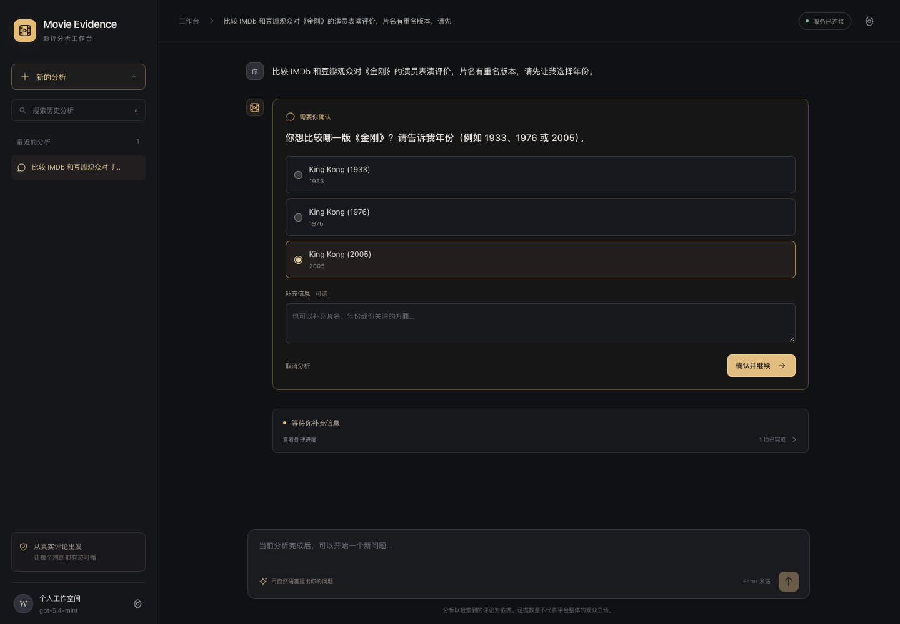
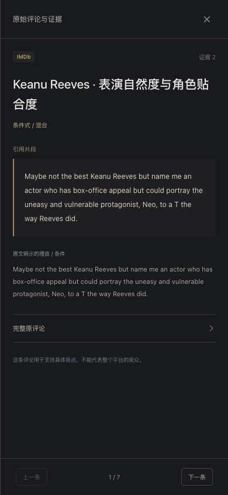

<div align="center">

# Movie Evidence Agent

**从真实评论出发，理解电影评价背后的观点。**

自然语言提问 · 动态澄清 · 可追溯报告 · 响应式工作台

[界面预览](#界面预览) · [功能一览](#功能一览) · [快速开始](#快速开始)

</div>


一个面向 IMDb 与豆瓣评论的电影分析工作台。输入电影和你关注的方面，Agent 会在需要时向你澄清，把检索到的观点组织成带引用的报告，并让你直接查看支持判断的原评论。

## 界面预览

### 一句话，开始一次分析

深色背景搭配琥珀色强调，围绕问题输入、当前分析和历史会话组织界面。首页提供电影问题卡片，可以直接填入问题后调整；模型配置集中在工作台设置中。

> 示例问题：比较 IMDb 和豆瓣观众如何评价《黑客帝国》(1999) 的演员表演？

### 有歧义时，让用户做选择

同名电影或信息不足时，通过澄清卡片选择电影版本、补充分析需求，再继续当前任务。



*以《金刚》为例：选择 1933、1976 或 2005 年版本，让分析对应到你想讨论的电影。*

### 点开引用，读到完整依据

报告中的证据编号可以打开侧栏，查看评价对象、立场、逐字引文、理由或条件，并展开完整原评论。报告支持复制和下载 Markdown，导出时保留证据编号。

### 手机上，也能完整使用

侧栏收起为菜单，问题卡片自动切换为两列；证据面板在手机上铺满屏幕，长评论可以独立滚动。

<table>
  <tr>
    <td align="center"><b>移动端工作台</b></td>
    <td align="center"><b>原评论与证据侧栏</b></td>
  </tr>
  <tr>
    <td align="center"></td>
    <td align="center"></td>
  </tr>
</table>

*桌面与手机界面均为项目实际运行截图。*

## 功能一览

| 功能 | 使用方式 |
| --- | --- |
| 自然语言问题 | 输入片名、平台和关注方面；Enter 发送，Shift + Enter 换行 |
| 动态澄清 | 选择候选、补充说明，然后继续当前分析 |
| 运行进度 | 查看当前阶段和已完成步骤，支持停止与失败重试 |
| 证据追溯 | 点开编号查看引文、理由和完整评论 |
| 会话管理 | 搜索、切换和删除分析记录，刷新页面后继续查看 |
| 报告导出 | 复制或下载包含证据编号的 Markdown |
| 模型设置 | 设置新会话使用的模型，密钥由后端管理 |

## 快速开始

需要 **Python 3.11+（推荐 3.12）** 和 **Node.js 20.19+ 或 22.12+**。

### 1. 安装运行依赖

```bash
git clone https://github.com/hoppee21/movie-review-agent.git
cd movie-review-agent

python -m pip install -r requirements.txt
python -m playwright install chromium

cp .env.example .env.local
cp config/source_cookies.example.json config/source_cookies.json
```

在 `.env.local` 中填写 `OPENAI_API_KEY`。需要平台登录时，在本地 `config/source_cookies.json` 中填写自己的 Cookie。

### 2. 构建界面

```bash
npm --prefix frontend ci
npm --prefix frontend run build
```

### 3. 启动工作台

```bash
python -u -m app.web --model gpt-5.4-mini
```

打开 **http://127.0.0.1:8000**，输入电影问题即可开始。模型名称可改为你的 OpenAI 项目可调用的模型。

## 技术栈

**前端：** React 18 · TypeScript · Vite  
**后端：** FastAPI · LangGraph · LangChain · OpenAI

